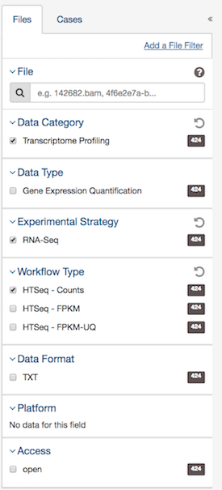

## Introduction

In this document, I explain the steps I used to derive the gene signatures for the three iClusters of 183 liver cancer patient samples clustered by [@cihcc]. They used datasets across five different platforms in forming the iClusters, while I only look at the mRNA expression dataset in forming the iCluster gene signatures. Using scores from `singscore` method, I trained a multinomial classification model that can be used for predicting iCluster labels for new samples.

In the [@cihcc] study, they classified new sample cohort dataset with the classfier they built and produced survival plot for the different iCluster groups in the new samples cohort (refer to Figure 3 at [@cihcc]. They identified samples in iCluster1 had lowest survival rate. 

I built an iCluster classifier using only the mRNA expression dataset and `singscore`. I scored the 183 liver cancer samples against the iCluster gene signatures using `singscore` and obtained three scores for each sample. I then used the obtained scores to train a classfier for new sample prediction.  

I scored the (FUDAN) dataset [@Roessler10202] GSE14520 with the three gene signatures and predicted the samples' cluster labels with the classification model trained using scores of the formed iCluster samples. I also did the survival analysis. The result  showed that iCluster1 had lowest survival rate, which was concordance with the article [@cihcc].


## Download count-data

We first download the dataset and then load the data in R. After that, we used some annotation files in identifying the samples' iCluster labels for Differential gene expression analysis.

The raw count data were downloaded from the Genomic Data Commons Data Portal https://portal.gdc.cancer.gov/ from project TCGA-LIHC. 424 samples were downloaded using the following filter rules.

The study by [@cihcc] had clustered the liver cancer patient samples into three groups.The sample IDs of patients within each cluster can be found in the TableS1[@cihcc].

## Load the raw read count data 

Before we load the raw read count data, we need to find the samples that we are interested in, which are the clustered samples from our downloaded files.

Now, we read in the TableS1 for samples' iCluster labels.

```{r readinmmc1,message=FALSE}
# load the libraries we need for the analysis

library(readxl)
library(edgeR)
library(limma)
library(singscore)
library(survival)
library(RColorBrewer)
library(ggplot2)


mmc1 <- read_excel("~/Documents/davisLab/mmc1.xlsx", skip = 3)
# have a look at some columns of the data
head(mmc1[,c(1,2,22,84)])

```

We analyse samples that have been clustered, so we remoe the "NA" rows.

```{r removeNA}
identified_clusters <- mmc1[!mmc1$`iCluster clusters (k=3, Ronglai Shen)`=="NA",]

# So we will be looking at 183 samples
dim(identified_clusters)

```

Then we construct the list of files of samples we are intested in. 

```{r sampleIDMapping}
# get the sample IDs of 183 samples
clustered_samples <- identified_clusters$Barcode

# From the sample sheet downloaded from GDC, we get the file names mapped to the 
# SampleID
gdc_sample_sheet.2018.03.28 <- 
  read.delim("~/Documents/davisLab/HCC/gdc_sample_sheet.2018-03-28.tsv", 
             quote="")

all_files <- 
  gdc_sample_sheet.2018.03.28[gdc_sample_sheet.2018.03.28$Sample.ID 
                              %in% clustered_samples,]

dim(all_files)
```

Load the raw count data from `all_files`. I used `edgeR`'s function for loading all samples' read count data at once.

```{r loadCountFiles,eval=TRUE}

files_path <- 
  paste0("/Users/ruqianlyu/Documents/davisLab/HCC/gdc_download_20180328_001539/",
                     all_files$File.ID, "/", all_files$File.Name)

# Use the readDGE function for edgeR for reading all samples' count files.
initial_dge_object <- edgeR::readDGE(files_path)

# Here is the dimension of the raw gene expression dataset
dim(initial_dge_object)

# Use shorter file names 
files_names <- substring(colnames(initial_dge_object), 107, 
                         nchar(colnames(initial_dge_object)))

# head(files_names)

# rename the column
colnames(initial_dge_object) <- files_names 
# rename the rows
rownames(initial_dge_object) = sub("\\.\\d+", "", rownames(initial_dge_object))
# Map the file_names to Sample.ID so that we can identify the cluster of the 
# counts
y <- as.data.frame(colnames(initial_dge_object))
colnames(y) <- "File.Name"

k <- as.data.frame(paste0(y$File.Name,".gz"))

colnames(k) <- "File.Name"

head(k)

# Using the sample sheet document to align the file name with Sample.ID
f <- merge(k, gdc_sample_sheet.2018.03.28, by = "File.Name", sort = FALSE)


# Use the mmc1 file to annotate the Samples with cluster labels
g <- merge(f, mmc1, by.x = "Sample.ID", by.y = "Barcode", sort = FALSE)

head(g[,c(1:2,29)])

# The factors that might be of interest
race <- as.factor(g$race)
gender <- as.factor(g$gender)

# group stores the cluster label for each sample
group <- as.factor(g$`iCluster clusters (k=3, Ronglai Shen)`)

#remove the ":" from cluster label
temp <- sapply(group, function(x){sub(":","",x)})
group <- temp

initial_dge_object$samples$group <- group
initial_dge_object$samples$race <- race
initial_dge_object$samples$gender <- gender

# Here we have the initial_dge_object which contains the count matrxi and sample
# information for 183 samples and 60487 ESEMBL transcript IDs
dim(initial_dge_object)

```


## Check gene types with `bioMart`

`bioMart` is an R pacakge that provides the interface with BioMart databases like Ensembl, COSMIC, Uniprot, HGNC, Gramene, Wormbase and dbSNP. Thus I used `bioMart` for annotating and filtering the genes in our dataset.  I only kept the protein coding genes for the following analysis.

```{r bioMartGeneType, eval=FALSE}
library(biomaRt)
ensembl=useMart("ensembl")
#listDatasets(ensembl)
ensembl = useDataset("hsapiens_gene_ensembl",mart=ensembl)
#listFilters(ensembl)
attrs = listAttributes(ensembl)

# mapToType = getBM(
#   attributes = c('transcript_biotype', 'entrezgene','ensembl_gene_id',
# 'ensembl_gene_id_version','hgnc_symbol'),
#   filters = 'entrezgene',
#   values = genes$ENTREZID,
#   mart = ensembl
# )
# save(mapToType,file = "mapToType.RData")
```

Load the saved annotation in `mapToType.RData` file

```{r loadMappingData}
load(file = "./mapToType.RData")

head(mapToType)


# Find the mappings for transcripts in our intial dge object
mappedTrans = mapToType[mapToType$ensembl_gene_id 
                        %in% rownames(initial_dge_object$counts),]

# Find the proten coding genes
mappedTrans = mappedTrans[mappedTrans$transcript_biotype == "protein_coding",]
# remove genes without symbol mapped
mappedTrans = mappedTrans[!mappedTrans$hgnc_symbol == "",]


dim(mappedTrans)

length(unique(mappedTrans$ensembl_gene_id))

# remove the duplicated mapping by ensembl_gene_id

dup <- mappedTrans$ensembl_gene_id[duplicated(mappedTrans$ensembl_gene_id)]
length(dup)

# The first 5 duplicated ones are 
# mappedTrans[mappedTrans$hgnc_symbol %in% dup,][1:5,]

# takes care of the duplication by keeping the first occurrence of each gene ID
# match returns a vector of the positions of (first) matches of its first argument in its 
# second
mat <- match(unique(mappedTrans$ensembl_gene_id), mappedTrans$ensembl_gene_id)
mappedTrans <- mappedTrans[mat,]

mat <- match(unique(mappedTrans$hgnc_symbol), mappedTrans$hgnc_symbol)
mappedTrans <- mappedTrans[mat,]

dim(mappedTrans)

# Use the `ENSEMBL` column remained in the `genes` to subset the initial dge object 
dge_object <- initial_dge_object[mappedTrans$ensembl_gene_id,]
dge_object$genes <- mappedTrans
rownames(dge_object) = mappedTrans$hgnc_symbol
# Cleaned dge_object
dim(dge_object)


```


## Data pre-processing for deriving DEGs for three iClusters

### Normalisation and filtering

```{r normalisation}

# raw counts are converted to CPM and log-CPM values using the CPM function provided by edgeR

cpmVal <- cpm(dge_object)
lcpm <- cpm(dge_object, log=TRUE)

# removing lowly expressed genes, 0 across all samples
table(rowSums(dge_object$counts==0)==183)

# keep genes expressed in at least 55 samples, 55 is the number of samples in the smallest group
keep.exprs <- rowSums(cpmVal>1)>=55

sum(keep.exprs)

dge_object <- dge_object[keep.exprs,, keep.lib.sizes=FALSE]
dim(dge_object)

```

Plot comparison of before and after filtering

```{r plotCompare}
nsamples <- ncol(dge_object)
col <- brewer.pal(nsamples, name = "Set1")
par(mfrow=c(1,2))
# Before filtering
plot(density(lcpm[,1]), col=col[1], lwd=2, ylim=c(0,0.21), 
     las=2, main="", xlab="")
title(main="A. Raw data", xlab="Log-cpm")
abline(v=0, lty=3)
for (i in 2:nsamples){
 den <- density(lcpm[,i])
 lines(den$x, den$y, col=col[i], lwd=2)
}

# legend("topright", samplenames, text.col=col, bty="n")
# After filtering
lcpm <- cpm(dge_object, log=TRUE)
plot(density(lcpm[,1]), col=col[1], lwd=2, ylim=c(0,0.21), las=2,
main="", xlab="")
title(main="B. Filtered data", xlab="Log-cpm") 
abline(v=0, lty=3)
for (i in 2:nsamples){
   den <- density(lcpm[,i])
   lines(den$x, den$y, col=col[i], lwd=2)
}  

# legend("topright", samplenames, text.col=col, bty="n")
```

### TMM normalisation
Normalisation by the method of trimmed mean of M-values (TMM)

```{r TMM}
dge_object <- calcNormFactors(dge_object, method = "TMM") 
head(dge_object$samples$norm.factors)

```

## Differential gene expression analysis 

After the gene expression dataset has been filtered and cleand, we can derive DEGs with functions from `limma`. I have referred to the 'RNASeq-1-2-3' [@rnaSeq123] article for carrying out the DGE analysis for the iCluster samples.

```{r contrastMatrix}
# Make the design matrix by group
design <- model.matrix(~0+group)
colnames(design) <- gsub("group", "", colnames(design)) 

# Make the contrast matrix in the way of comparing each one of the cluster 
# with the rest.
contr.matrix2 <- makeContrasts(
   c1vsc2_3 = iCluster1-(iCluster2+iCluster3)/2,
   c2vsc1_3 = iCluster2-(iCluster1+iCluster3)/2,
   c3vsc1_2 = iCluster3-(iCluster1+iCluster2)/2,
   levels = colnames(design))

# Use the voom function to tranform our RNA-seq data for linear modelling
v <- voom(dge_object, design, plot=FALSE)

# Fit liear model to our transformed data
vfit <- lmFit(v, design)
vfit <- contrasts.fit(vfit, contrasts=contr.matrix2)
# empirical Bayes moderation is carried out by the eBayes function 
efit <- eBayes(vfit)

summary(decideTests(efit))


tfit <- treat(efit, lfc=log2(1.27))
dt <- decideTests(tfit)
summary(dt)


new.c1.vs.c23 <- topTreat(tfit, coef=1, n=Inf, p.value = 0.01)
new.c2.vs.c13 <- topTreat(tfit, coef=2, n=Inf, p.value = 0.01)
new.c3.vs.c12 <- topTreat(tfit, coef=3, n=Inf, p.value = 0.01)

dim(new.c1.vs.c23)
dim(new.c2.vs.c13)
dim(new.c3.vs.c12)

# Generate the MD plot
plotMD(tfit, column=1, status=dt[,1], main='iCluster1 vs rest',xlim=c(-8,13))
plotMD(tfit, column=2, status=dt[,2], main='iCluster2 vs rest',xlim=c(-8,13))
plotMD(tfit, column=3, status=dt[,3], main='iCluster3 vs rest',xlim=c(-8,13))


# From the DEGs for c1.vs.c23, we select the more signicant and with large logFC
plot(new.c1.vs.c23$logFC, -log10(new.c1.vs.c23$P.Value))


new.c1.vs.c23 <- new.c1.vs.c23[-log10(new.c1.vs.c23$P.Value)> 7 
                               & (abs(new.c1.vs.c23$logFC)>1.55),]
dim(new.c1.vs.c23)

#write the final iCluster gene signatures to files

write.table(new.c1.vs.c23, file = "new.c1.vs.c23.txt")
write.table(new.c2.vs.c13, file = "new.c2.vs.c13.txt")
write.table(new.c3.vs.c12, file = "new.c3.vs.c12.txt")


```

### Obtain the up-regulated gene sets and down-regulated gene sets for each gene signauture

```{r summarizeGeneSet}
up_ic1 <- new.c1.vs.c23[new.c1.vs.c23$logFC>0,]
dn_ic1 <- new.c1.vs.c23[new.c1.vs.c23$logFC<0,]

up_ic2 <- new.c2.vs.c13[new.c2.vs.c13$logFC>0,]
dn_ic2 <- new.c2.vs.c13[new.c2.vs.c13$logFC<0,]

up_ic3 <- new.c3.vs.c12[new.c3.vs.c12$logFC>0,]
dn_ic3 <- new.c3.vs.c12[new.c3.vs.c12$logFC<0,]

up_ic1_gs <- up_ic1$hgnc_symbol
dn_ic1_gs <- dn_ic1$hgnc_symbol

up_ic2_gs <- up_ic2$hgnc_symbol
dn_ic2_gs <- dn_ic2$hgnc_symbol

up_ic3_gs <- up_ic3$hgnc_symbol
dn_ic3_gs <- dn_ic3$hgnc_symbol

```

## Score the iCluster dataset with `singscore`

The 183 liver cancer samples with known iClusters labels were scored against the three gene signatures obtained above. The scoring results were used to train a multinomial classification model.

```{r scoring}

rankedData = rankGenes(dge_object$counts)
#rownames(rankedData) = dge_object$genes$hgnc_symbol

#head(rankedData)
# Score the data set using three gene signatures respectively
scoredf1 = simpleScore(rankedData, upSet = up_ic1_gs, downSet = dn_ic1_gs, 
                       centerScore = TRUE)
scoredf2 = simpleScore(rankedData, upSet = up_ic2_gs, downSet = dn_ic2_gs, 
                       centerScore = TRUE)
scoredf3 = simpleScore(rankedData, upSet = up_ic3_gs, downSet = dn_ic3_gs, 
                       centerScore = TRUE)

cluster1Samples = g$File.Name[g$`iCluster clusters (k=3, Ronglai Shen)` 
                              == "iCluster:1"]
cluster2Samples = g$File.Name[g$`iCluster clusters (k=3, Ronglai Shen)` 
                              == "iCluster:2"]
cluster3Samples = g$File.Name[g$`iCluster clusters (k=3, Ronglai Shen)` 
                              == "iCluster:3"]


scoredf1_pdf = data.frame(files = rownames(scoredf1),scoredf1$TotalScore, 
                          group = dge_object$samples$group)

scoredf2_pdf = data.frame(files = rownames(scoredf2),scoredf2$TotalScore, 
                          group = dge_object$samples$group)


scoredf3_pdf = data.frame(files = rownames(scoredf3),scoredf3$TotalScore, 
                          group = dge_object$samples$group)

all = merge(merge(scoredf1_pdf, scoredf2_pdf, by.x = "files", by.y = "files"), 
            scoredf3_pdf, by = "files")
rownames(all) = all$files
all = all[,c(2,4,6,7)]
textSize = 1.5


# The 2D landscape scatter plot for all samples


ggplot(data = all)+
  geom_point(aes(x = `scoredf1.TotalScore`,y=`scoredf2.TotalScore`, 
                 colour = group, shape = group),size = 2)+
  xlab("iCluster1 Scores")+
  ylab("iCluster2 Scores")+
  theme_minimal() +
    theme(
      panel.grid.major = element_blank(),
      panel.grid.minor = element_blank(),
      axis.title = element_text(size = rel(textSize)),
      axis.text.x = element_text(angle = 0, size = rel(textSize)),
      axis.text.y = element_text(angle = 0, size = rel(textSize)),
      strip.background = element_rect(colour = "#f0f0f0",
                                      fill = "#f0f0f0"),
      strip.text = element_text(size = rel(textSize)),
      axis.line = element_line(colour = "black"),
      axis.ticks = element_line(),
      legend.position = "bottom",
      legend.direction = "horizontal",
      legend.margin = margin(unit(0, "cm")),
      legend.text = element_text(face = "italic", size = 15),
      legend.title = element_text(face = "italic", size = 15),
      plot.title = element_text(
        face = "bold",
        size = rel(textSize),
        hjust = 0.5
      )
    )


ggplot(data = all)+
  geom_point(aes(x = `scoredf2.TotalScore`,y=`scoredf3.TotalScore`, 
                 colour = group, shape = group),size = 2)+
  xlab("iCluster2 Scores")+
  ylab("iCluster3 Scores")+
  theme_minimal() +
    theme(
      panel.grid.major = element_blank(),
      panel.grid.minor = element_blank(),
      axis.title = element_text(size = rel(textSize)),
      axis.text.x = element_text(angle = 0, size = rel(textSize)),
      axis.text.y = element_text(angle = 0, size = rel(textSize)),
      strip.background = element_rect(colour = "#f0f0f0",
                                      fill = "#f0f0f0"),
      strip.text = element_text(size = rel(textSize)),
      axis.line = element_line(colour = "black"),
      axis.ticks = element_line(),
      legend.position = "bottom",
      legend.direction = "horizontal",
      legend.margin = margin(unit(0, "cm")),
      legend.text = element_text(face = "italic", size = 15),
      legend.title = element_text(face = "italic", size = 15),
      plot.title = element_text(
        face = "bold",
        size = rel(textSize),
        hjust = 0.5
      )
    )


ggplot(data = all)+
  geom_point(aes(x = `scoredf1.TotalScore`,y=`scoredf3.TotalScore`, 
                 colour = group, shape = group),size = 2)+
  xlab("iCluster1 Scores")+
  ylab("iCluster3 Scores")+
  theme_minimal() +
    theme(
      panel.grid.major = element_blank(),
      panel.grid.minor = element_blank(),
      axis.title = element_text(size = rel(textSize)),
      axis.text.x = element_text(angle = 0, size = rel(textSize)),
      axis.text.y = element_text(angle = 0, size = rel(textSize)),
      strip.background = element_rect(colour = "#f0f0f0",
                                      fill = "#f0f0f0"),
      strip.text = element_text(size = rel(textSize)),
      axis.line = element_line(colour = "black"),
      axis.ticks = element_line(),
      legend.position = "bottom",
      legend.direction = "horizontal",
      legend.margin = margin(unit(0, "cm")),
      legend.text = element_text(face = "italic", size = 15),
      legend.title = element_text(face = "italic", size = 15),
      plot.title = element_text(
        face = "bold",
        size = rel(textSize),
        hjust = 0.5
      )
    )


```

We can also generate a 3D plot for all samples' scores against 3 gene signatures.

```{r 3Dplot,eval=FALSE}
library(plotly)
all$group = as.factor(all$group)

p <- plot_ly(all, x = ~scoredf1.TotalScore, y = ~scoredf2.TotalScore, 
             z = ~scoredf1.TotalScore, color = ~group, 
             colors = c('red', 'blue', 'green')) %>%
  add_markers() %>%
  layout(scene = list(xaxis = list(title = 'iCGS1'),
                     yaxis = list(title = 'iCGS2'),
                     zaxis = list(title = 'iCGS3')))

```

## Build the Classification model 

Train a multinomial classification model with all samples's scores and the response variable as the iCluster labels.


```{r classificationModel}
# Train a multinorm classification model with all samples's scores
all$group = as.character(all$group)


library(nnet)
regressionLm = multinom(group ~ ., data = all, family = binomial(link="logit") )
summary(regressionLm)
predictions = predict(regressionLm, all, type="class")

# The mis-classfication error:
sum(!predictions==all$group)/length(all$group)
```

## New FUDAN dataset

In the next step, new microarray gene expression dataset of liver cancer samples were downloaded and scored.
We use the multinomial classification model we trained before to classify the new sample cohort into iClusters and perform the survival analysis to check whether iCluster1's survival rate is the lowest.

### Download the new gene expression data from GEO.

```{r datasetLoad, eval=FALSE, message=FALSE}

library(GEOquery)
gse = getGEO(GEO = "GSE14520")
gse[[1]]
# I saved the downloaded data into RData object
save(gse, file = "gse.RData")
```


### Get the FUDAN sample cohort gene expression intensity dataset

The gene set from GEO omin, GSE14520, microarray gene expression dataset

```{r getCount,message=FALSE}
load("./gse.RData")
newHCC = gse[[1]]
exprs(newHCC)[1:5,1:5]
summary(exprs(newHCC)[,1:5])
```

Get the gene expression matrxi for all new samples

```{r makeGEM}

dim(pData(newHCC))
dim(fData(newHCC))

geneMatrix = exprs(newHCC)

# find probes with Symbol
features = fData(newHCC)
pheoNew = pData(newHCC)

tumourSample = pheoNew$geo_accession[pheoNew$`Tissue:ch1`=="Liver Tumor Tissue"]
tumourSample = c(tumourSample,
                 pheoNew$geo_accession[pheoNew$`tissue:ch1`=="Liver Tumor Tissue"])
tumourSample = tumourSample[!is.na(tumourSample)]
keep = features[features$`Gene Symbol` %in% mapToType$hgnc_symbol[mapToType$transcript_biotype=="protein_coding"],]

# keep = keep[!keep$Protein_Product=="",]
# 
geneMatrix = geneMatrix[keep$ID,]
rownames(geneMatrix) = keep$`Gene Symbol`

geneMatrix = geneMatrix[, tumourSample]

dim(geneMatrix)


```

### Scoring FUDAN samples using `singscore` against the three iCluster gene signatures

```{r scoringGS1, message=FALSE}

rankedNew = rankGenes(geneMatrix)
scoredNewDf1 = simpleScore(rankedNew, upSet = up_ic1_gs, downSet = dn_ic1_gs)
scoredNewDf2 = simpleScore(rankedNew, upSet = up_ic2_gs, downSet = dn_ic2_gs)
scoredNewDf3 = simpleScore(rankedNew, upSet = up_ic3_gs, downSet = dn_ic3_gs)
newData = data.frame(GS1 = scoredNewDf1$TotalScore, 
                     GS2 = scoredNewDf2$TotalScore, 
                     GS3 = scoredNewDf3$TotalScore)
rownames(newData) = rownames(scoredNewDf1)
colnames(newData) = c("scoredf1.TotalScore", "scoredf2.TotalScore", 
                      "scoredf3.TotalScore")

newPredictions =  predict(regressionLm, newData, type="class")
# group1 = rownames(scoredNewDf1[order(scoredNewDf1$TotalScore, decreasing = TRUE),][1:35,])
# group2 = rownames(scoredNewDf1[order(scoredNewDf1$TotalScore, decreasing = TRUE),][36:100,])

newDf = data.frame(pred = newPredictions, "GSM" = rownames(newData))

```

### Survival Analysis of iClustered FUDAN samples

With the new samples' predicted iCluster labels, we do survival analysis

```{r survivalAna}
library(survival)

sur.os = read.delim("~/Documents/davisLab/HCC/GSE14520_Extra_Supplement.txt", 
                    quote="", stringsAsFactors=FALSE)

surdf = merge(newDf, sur.os, by.x = "GSM", by.y = "Affy_GSM")
newData$GSM = rownames(newData)
surdf = merge(surdf, newData, by.x = "GSM", by.y = "GSM")

mydata<-surdf
mydata = na.omit(mydata)
## Step (1)
## Create the Survival Object

mySurv<-Surv(time=mydata$Survival.months, event = mydata$Survival.status)
#class(mySurv)
head(mySurv)
mydata$AgeGroup = "Young"
mydata$AgeGroup[mydata$Age> median(mydata$Age,na.rm = TRUE)] = "Old"
mydata$AgeGroup = as.factor(mydata$AgeGroup)

## specify predictor variable in =the formula
myfit<-survfit(mySurv~mydata$pred)
table(mydata$pred)

survdiff(mySurv~pred+mydata$Main.Tumor.Size......5.cm.,
         data = mydata) 
###  plot the inverse of a survival function

plot(myfit, col=c("blue","red","purple"), mark=3) ## mark.time=T marked at 
## each censoring time
legend("topright", c("iCluster1","iCluster2",'iCluster3'), 
       col=c("blue","red","purple"), lty=1)

```

## supplementary

This section we did a survival analysis for the origial iClustered samples from information enclosed in the clinical.tsv downloaded from GDC.

```{r tcgaSurvival}
clinical <- read.delim("~/Documents/davisLab/HCC/clinical.cart.2018-05-16/clinical.tsv", quote="", stringsAsFactors=FALSE)

time = rep("0",dim(clinical)[1])
time = sapply(1:dim(clinical)[1], function(x){
  if(clinical$days_to_death[x]=="--"){
    time[x] = clinical$days_to_last_follow_up[x]}
  else{
    time[x] = clinical$days_to_death[x]}})

clinical$time =as.numeric(time)
dim(merge(clinical, g, by.x = 'submitter_id', by.y = "Case.ID"))

icluster_clinical = merge(clinical, g, by.x = 'submitter_id', by.y = "Case.ID")
icluster_clinical$vital_status[icluster_clinical$vital_status=="dead"] = 1 
icluster_clinical$vital_status[icluster_clinical$vital_status=="alive"] = 0
icluster_clinical$vital_status = as.numeric(icluster_clinical$vital_status)
tcgaSurv = Surv(time=icluster_clinical$time, event = icluster_clinical$vital_status)

tcgaSurv.fit <- survfit(tcgaSurv~icluster_clinical$`iCluster clusters (k=3, Ronglai Shen)`)
plot(tcgaSurv.fit, col=c("red","blue","green"))
legend("topright", c("iCluster1","iCluster2",'iCluster3'), col=c("blue","red","purple"), lty=1)

survdiff(tcgaSurv~icluster_clinical$`iCluster clusters (k=3, Ronglai Shen)`)
```


## References

